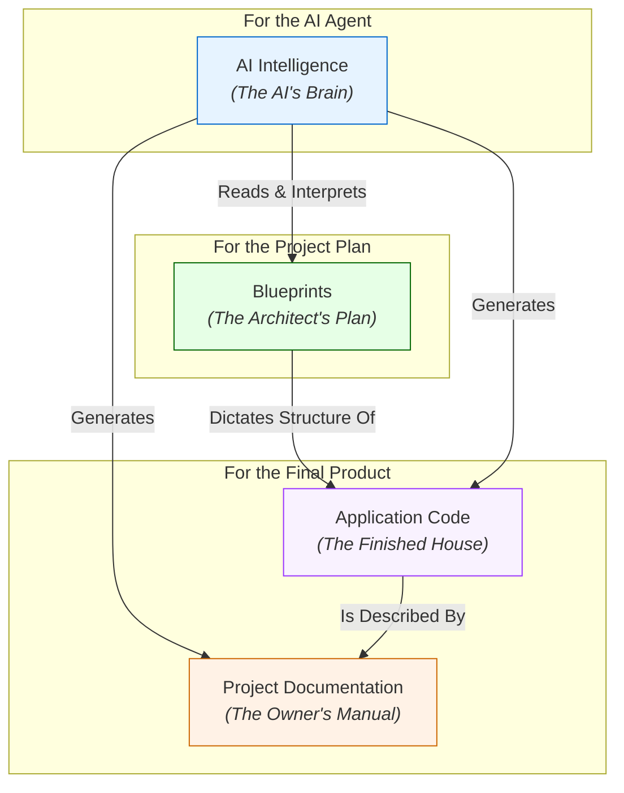

# Vibe Lab - Project Structure Philosophy

This document explains the separation of concerns within the Vibe Lab's internal structure. This architecture is designed to clearly distinguish between the AI's own instructions, the project's strategic plan, the project's detailed documentation, and the final application code.

---

### 1. Blueprints: The "Architect's Plan"

*   **Location:** `Vibe_Lab_SaaS_Project (TEMPLATE)/00-Blueprint/`
*   **Purpose:** This directory holds the **strategic "before" picture** of the application. These documents define the *intent*—what we plan to build, for whom, and how. They are created collaboratively between the user and the AI *before* any major documentation or code is generated.
*   **Analogy:** These are the architectural blueprints for a house. They describe the design, layout, and materials, but they are not the house itself.
*   **Key Documents:** `02-CORE-FEATURES.md`, `03-UI_UX_Blueprint.md`, `10-AI-INTEGRATION-ARCHITECTURE.md`.

### 2. Project Documentation: The "Owner's Manual"

*   **Location:** `Vibe_Lab_SaaS_Project (TEMPLATE)/Documentation/`
*   **Purpose:** This is the destination for the **detailed "after" picture** of the application. It contains the comprehensive, "living" documentation that is generated by the AI based on the approved blueprints and the final code.
*   **Analogy:** This is the complete owner's manual for a new car, detailing how every system works, from the engine to the infotainment screen.
*   **Key Documents:** The `tier-1-comprehensive/` master documents, the `tier-2-quick/` summaries, and the `tier-3-patterns/` for code reuse. It's also where the `Project_Roadmap.md` lives.

### 3. AI Intelligence: The "AI's Brain & Operating System"

*   **Location:** `Vibe_Lab_SaaS_Project (TEMPLATE)/intelligence/`
*   **Purpose:** This is the most "meta" directory. It contains the documentation **for the AI agent itself**, not for the application it builds. It holds the instructions, memories, patterns, and logic that govern the AI's behavior, decision-making processes, and personality.
*   **Analogy:** These are the flight manuals, checklists, and standard operating procedures for a pilot. They don't describe the plane; they describe *how the pilot should fly the plane*.
*   **Key Documents:** `00_START_HERE.md`, `memory-banks/`, and the various `.json` index files.

### 4. Application Directory Format: The "Construction Site"

*   **Location:** `Vibe_Lab_SaaS_Project (TEMPLATE)/New Project/`
*   **Purpose:** This directory is the **destination for the final, tangible code output**. It starts as a nearly empty scaffold (`package.json`, `tsconfig.json`, etc.) and is progressively filled with the actual application code (`app/`, `components/`, `lib/`) by the AI during the "Vibe Coding" phase, following the roadmap.
*   **Analogy:** This is the prepared construction site, with the foundation laid, waiting for the framing, walls, and roof to be built.

---

### Summary Diagram

In essence, the Vibe Lab system intentionally separates the documentation about the *AI's process* (`intelligence`), the *project's intent* (`00-Blueprint`), the *project's final state* (`Documentation`), and the *project's code* (`New Project`). This separation of concerns is a core principle of its design. 