# Roadmap 8: AI System Integration Enhancement
**Primary Goal**: Complete SuperClaude framework integration and advance Vibe Lab AI capabilities to production-ready state with zero breaking changes to existing functionality.

**Status**: Ready for Implementation  
**Timeline**: 4 weeks  
**Complexity**: High  
**Dependencies**: Roadmap 2 (AI System Implementation) - Completed

---

## Overview

This roadmap implements the comprehensive AI system enhancements identified in the August 2025 intelligence audit. The approach maintains **100% backward compatibility** while adding significant SuperClaude framework capabilities through incremental integration.

### Key Achievements from Audit
- ✅ **Foundation Assessment**: AVCA (70% complete), DIAS (60% complete) 
- ✅ **Architecture Analysis**: Identified persona system gaps and integration opportunities
- ✅ **Enhancement Strategy**: Designed zero-breaking-change integration approach
- ✅ **Core Components**: PersonaMapper, EnhancedAIClient, and MCP services created

---

## Phase 1: Foundation Enhancement (Week 1)
**Objective**: Activate existing enhancements and establish SuperClaude integration foundation

### **Task 1.1: Install and Activate Integration Services**
**Complexity**: 3/10 | **Priority**: Critical | **Duration**: 2 days

**Implementation Steps**:
```bash
# Files already created - activate integration
src/lib/integration/
├── persona-mapper.ts          # ✅ AVCA ↔ DIAS bridge
├── enhanced-ai-client.ts      # ✅ SuperClaude integration
└── mcp-context7-service.ts    # ✅ Documentation lookup

src/app/api/
├── plan/route.ts              # ✅ Strategic planning endpoint
├── review/route.ts            # ✅ Code review endpoint
└── help/route.ts              # ✅ Intelligent guidance endpoint
```

**Activation Checklist**:
- [ ] Import PersonaMapper in existing services
- [ ] Update AI client initialization to use EnhancedAIClient
- [ ] Configure Context7 service in service registry
- [ ] Add environment variables for SuperClaude CLI paths
- [ ] Test new API endpoints with existing frontend components

**Success Criteria**:
- All existing functionality works unchanged
- New endpoints respond correctly
- PersonaMapper provides accurate role-to-persona mapping
- Context7 service successfully retrieves documentation

### **Task 1.2: Frontend Integration Updates**
**Complexity**: 4/10 | **Priority**: High | **Duration**: 2 days

**Components to Update**:
```typescript
// Example integration in existing chat component
import { createEnhancedAIClient } from '@/lib/integration/enhanced-ai-client';
import { personaMapper } from '@/lib/integration/persona-mapper';

// Gradual enhancement - existing code unchanged
const aiClient = createEnhancedAIClient(eventBus, true); // Enable SuperClaude

// Add new endpoint integration
const handlePlanRequest = async (prompt: string) => {
  const response = await fetch('/api/plan', {
    method: 'POST',
    headers: { 'Content-Type': 'application/json' },
    body: JSON.stringify({ prompt })
  });
  return response.json();
};
```

**Integration Points**:
- [ ] Update chat components for new endpoints
- [ ] Add persona display in AI responses
- [ ] Implement feature flags for gradual rollout
- [ ] Add error handling for SuperClaude integration
- [ ] Create UI indicators for enhanced vs standard AI responses

**Success Criteria**:
- Users can access planning, review, and help features
- Persona information displayed in responses
- Feature flags allow controlled rollout
- Error handling provides graceful degradation

### **Task 1.3: Testing and Validation**
**Complexity**: 5/10 | **Priority**: Critical | **Duration**: 2 days

**Testing Strategy**:
```bash
# API Testing
curl -X POST http://localhost:3000/api/plan \
  -H "Content-Type: application/json" \
  -d '{"prompt": "Design microservices architecture"}'

curl -X POST http://localhost:3000/api/review \
  -H "Content-Type: application/json" \
  -d '{"prompt": "Review React component", "codeToReview": "component code"}'

curl -X GET http://localhost:3000/api/help?topic=personas
```

**Test Cases**:
- [ ] Backward compatibility: All existing AI interactions work unchanged
- [ ] New endpoints: Strategic planning, code review, help system
- [ ] Persona mapping: Correct persona selection for different contexts
- [ ] Error handling: Graceful fallback when SuperClaude unavailable
- [ ] Performance: Response times within acceptable ranges
- [ ] Context7 integration: Documentation lookup functionality

**Success Criteria**:
- 100% backward compatibility maintained
- All new endpoints functional and performant
- Error scenarios handled gracefully
- Documentation and examples accessible

---

## Phase 2: MCP Server Integration (Week 2)
**Objective**: Complete integration of remaining MCP servers for enhanced AI capabilities

### **Task 2.1: Sequential MCP Server Integration**
**Complexity**: 7/10 | **Priority**: High | **Duration**: 3 days

**Purpose**: Complex analysis, multi-step reasoning, and systematic problem-solving

**Implementation**:
```typescript
// src/lib/integration/mcp-sequential-service.ts
export class SequentialService extends BaseService {
  async performComplexAnalysis(request: {
    problem: string;
    context?: string;
    steps?: number;
    thinkingMode?: 'standard' | 'deep' | 'ultra';
  }): Promise<SequentialResponse> {
    // Multi-step reasoning implementation
  }
  
  async systematicDebugging(request: {
    issue: string;
    codeContext: string;
    logs?: string;
  }): Promise<DebuggingResponse> {
    // Systematic debugging workflow
  }
}
```

**Integration Points**:
- [ ] Create SequentialService with BaseService pattern
- [ ] Implement multi-step analysis workflows
- [ ] Add systematic debugging capabilities
- [ ] Integrate with existing DIAS analysis processors
- [ ] Update AI orchestrator to use Sequential for complex tasks

**Success Criteria**:
- Complex analysis requests routed to Sequential automatically
- Multi-step reasoning produces higher quality results
- Debugging workflows provide systematic issue resolution
- Integration seamless with existing DIAS services

### **Task 2.2: Magic MCP Server Integration**
**Complexity**: 6/10 | **Priority**: High | **Duration**: 3 days

**Purpose**: UI component generation, design system integration, modern frontend patterns

**Implementation**:
```typescript
// src/lib/integration/mcp-magic-service.ts
export class MagicService extends BaseService {
  async generateComponent(request: {
    description: string;
    framework: 'react' | 'vue' | 'angular';
    designSystem?: 'tailwind' | 'mui' | 'chakra';
    complexity?: 'simple' | 'moderate' | 'complex';
  }): Promise<ComponentResponse> {
    // Component generation with design system integration
  }
  
  async enhanceExistingComponent(request: {
    componentCode: string;
    enhancements: string[];
  }): Promise<EnhancementResponse> {
    // Component enhancement and optimization
  }
}
```

**Integration Points**:
- [ ] Create MagicService for UI component generation
- [ ] Integrate with AVCA component pipeline
- [ ] Add design system pattern recognition
- [ ] Update blueprint service to use Magic for UI generation
- [ ] Implement component enhancement workflows

**Success Criteria**:
- UI component requests automatically routed to Magic
- Generated components follow project design system
- Integration enhances AVCA pipeline without breaking changes
- Component quality improves with Magic integration

### **Task 2.3: Playwright MCP Server Integration**
**Complexity**: 8/10 | **Priority**: Medium | **Duration**: 2 days

**Purpose**: E2E testing, browser automation, performance monitoring, visual testing

**Implementation**:
```typescript
// src/lib/integration/mcp-playwright-service.ts
export class PlaywrightService extends BaseService {
  async generateE2ETests(request: {
    userStory: string;
    components: string[];
    testType: 'functional' | 'visual' | 'performance';
  }): Promise<TestGenerationResponse> {
    // E2E test generation based on user stories
  }
  
  async performVisualTesting(request: {
    componentPath: string;
    viewports: string[];
    browsers: string[];
  }): Promise<VisualTestResponse> {
    // Cross-browser visual testing
  }
}
```

**Integration Points**:
- [ ] Create PlaywrightService for testing automation
- [ ] Integrate with AVCA quality assurance pipeline
- [ ] Add visual regression testing capabilities
- [ ] Update QA persona to use Playwright for testing
- [ ] Implement performance monitoring workflows

**Success Criteria**:
- Testing requests automatically routed to Playwright
- Visual testing integrated with component pipeline
- Performance monitoring provides actionable insights
- E2E test generation reduces manual testing effort

---

## Phase 3: Advanced AI Capabilities (Week 3)
**Objective**: Implement wave orchestration, quality gates, and intelligent delegation

### **Task 3.1: Wave Orchestration System**
**Complexity**: 9/10 | **Priority**: High | **Duration**: 4 days

**Purpose**: Multi-stage complex operation handling with compound intelligence

**Implementation**:
```typescript
// src/lib/integration/wave-orchestrator.ts
export class WaveOrchestrator extends BaseService {
  async executeWaveOperation(request: {
    operation: string;
    complexity: number;
    stages: WaveStage[];
    delegation?: DelegationStrategy;
  }): Promise<WaveResponse> {
    // Multi-stage wave execution with intelligent coordination
  }
  
  async progressiveEnhancement(request: {
    target: string;
    phases: EnhancementPhase[];
    validation: ValidationRules;
  }): Promise<ProgressiveResponse> {
    // Progressive enhancement with validation gates
  }
}
```

**Wave Strategies**:
- [ ] **Progressive**: Iterative enhancement with validation checkpoints
- [ ] **Systematic**: Comprehensive methodical analysis
- [ ] **Adaptive**: Dynamic configuration based on complexity
- [ ] **Enterprise**: Large-scale orchestration for complex systems

**Integration Points**:
- [ ] Create WaveOrchestrator service
- [ ] Implement stage coordination and validation
- [ ] Add delegation strategies for parallel processing
- [ ] Update AI orchestrator to detect wave-eligible operations
- [ ] Integrate with existing DIAS services

**Success Criteria**:
- Complex operations automatically trigger wave orchestration
- Multi-stage processing produces superior results
- Validation gates ensure quality at each stage
- Delegation optimizes processing time and resources

### **Task 3.2: Quality Gates Implementation**
**Complexity**: 7/10 | **Priority**: High | **Duration**: 3 days

**Purpose**: 8-step validation cycle with automated quality enforcement

**Implementation**:
```typescript
// src/lib/integration/quality-gates.ts
export class QualityGatesService extends BaseService {
  private readonly VALIDATION_STEPS = [
    'syntax', 'type', 'lint', 'security', 
    'test', 'performance', 'documentation', 'integration'
  ];
  
  async validateStage(stage: string, code: string, context: ValidationContext): Promise<ValidationResult> {
    // Stage-specific validation with AI integration
  }
  
  async comprehensiveValidation(request: ValidationRequest): Promise<QualityReport> {
    // Full 8-step validation cycle
  }
}
```

**Quality Gates**:
- [ ] **Step 1-2**: Syntax and type checking with intelligent suggestions
- [ ] **Step 3**: Linting with context-aware rule application
- [ ] **Step 4**: Security analysis with vulnerability assessment
- [ ] **Step 5**: Test coverage analysis and gap identification
- [ ] **Step 6**: Performance analysis with optimization suggestions
- [ ] **Step 7**: Documentation completeness and accuracy verification
- [ ] **Step 8**: Integration testing with deployment validation

**Integration Points**:
- [ ] Integrate with AVCA pipeline stages
- [ ] Add quality gate checkpoints to component generation
- [ ] Update blueprint service with validation requirements
- [ ] Implement automated quality reporting
- [ ] Add quality metrics to AI responses

**Success Criteria**:
- All generated code passes quality gates automatically
- Quality issues identified and resolved systematically
- Quality metrics tracked and reported consistently
- Integration improves overall system reliability

---

## Phase 4: Production Optimization (Week 4)
**Objective**: Performance optimization, monitoring, and production readiness

### **Task 4.1: Performance Optimization and Monitoring**
**Complexity**: 6/10 | **Priority**: Medium | **Duration**: 3 days

**Optimization Areas**:
```typescript
// Performance monitoring and optimization
export class PerformanceMonitor {
  async trackAIResponseTimes(): Promise<MetricsReport> {
    // Response time tracking and optimization
  }
  
  async optimizeTokenUsage(): Promise<OptimizationReport> {
    // Token usage optimization and cost reduction
  }
  
  async cacheOptimization(): Promise<CacheReport> {
    // Intelligent caching strategy optimization
  }
}
```

**Optimization Targets**:
- [ ] **Response Time**: <2s for standard requests, <5s for complex analysis
- [ ] **Token Efficiency**: 30-50% reduction through intelligent compression
- [ ] **Cache Hit Rate**: >80% for documentation and pattern lookups
- [ ] **Cost Optimization**: Intelligent model selection (Haiku/Sonnet/Opus)
- [ ] **Resource Utilization**: Optimal CPU and memory usage

**Monitoring Implementation**:
- [ ] Real-time performance metrics dashboard
- [ ] Automated alerts for performance degradation
- [ ] Cost tracking and budget alerts
- [ ] Usage pattern analysis and optimization suggestions
- [ ] A/B testing framework for AI improvements

**Success Criteria**:
- Response times meet or exceed targets
- Token usage optimized without quality loss
- Cost management within budget constraints
- Monitoring provides actionable insights

### **Task 4.2: Advanced Analytics and Learning Systems**
**Complexity**: 8/10 | **Priority**: Medium | **Duration**: 3 days

**Analytics Implementation**:
```typescript
// src/lib/integration/analytics-service.ts
export class AnalyticsService extends BaseService {
  async trackUsagePatterns(): Promise<UsageReport> {
    // User interaction and preference analysis
  }
  
  async optimizePersonaSelection(): Promise<OptimizationReport> {
    // ML-based persona selection optimization
  }
  
  async predictiveAnalytics(): Promise<PredictionReport> {
    // Predictive insights for system optimization
  }
}
```

**Learning Systems**:
- [ ] **Usage Pattern Analysis**: Track which personas and commands are most effective
- [ ] **Adaptive Persona Selection**: ML-based improvement of persona routing
- [ ] **Predictive Quality**: Predict code quality issues before generation
- [ ] **User Preference Learning**: Adapt responses to user preferences and style
- [ ] **System Optimization**: Continuous improvement based on usage data

**Analytics Features**:
- [ ] User behavior tracking and analysis
- [ ] AI performance metrics and trends
- [ ] Cost analysis and optimization recommendations
- [ ] Quality metrics and improvement tracking
- [ ] Predictive maintenance for AI services

**Success Criteria**:
- Usage patterns provide optimization insights
- Persona selection accuracy improves over time
- Predictive analytics reduce issues proactively
- Learning systems enhance user experience

### **Task 4.3: Documentation and Training Materials**
**Complexity**: 4/10 | **Priority**: High | **Duration**: 2 days

**Documentation Deliverables**:
- [ ] **User Guide**: Complete guide to enhanced AI capabilities
- [ ] **API Documentation**: Comprehensive API reference and examples
- [ ] **Integration Guide**: Step-by-step integration instructions
- [ ] **Troubleshooting Guide**: Common issues and solutions
- [ ] **Best Practices**: Recommended usage patterns and optimization tips

**Training Materials**:
- [ ] **Video Tutorials**: Screen recordings of key features and workflows
- [ ] **Interactive Examples**: Hands-on examples and code samples
- [ ] **FAQ Documentation**: Common questions and detailed answers
- [ ] **Migration Guide**: Upgrading from basic to enhanced AI features
- [ ] **Performance Optimization Guide**: Tips for optimal system performance

**Success Criteria**:
- Documentation covers all enhanced features comprehensively
- Users can successfully integrate and use new capabilities
- Training materials reduce support requests
- Best practices guide optimal system usage

---

## Implementation Timeline

```mermaid
gantt
    title AI System Integration Enhancement Timeline
    dateFormat  X
    axisFormat %w
    
    section Phase 1: Foundation
    Install Integration Services     :crit, phase1-1, 0, 2
    Frontend Integration            :crit, phase1-2, 2, 2  
    Testing & Validation           :crit, phase1-3, 4, 2
    
    section Phase 2: MCP Integration
    Sequential Server              :phase2-1, 7, 3
    Magic Server                   :phase2-2, 7, 3
    Playwright Server              :phase2-3, 10, 2
    
    section Phase 3: Advanced AI
    Wave Orchestration             :crit, phase3-1, 14, 4
    Quality Gates                  :phase3-2, 14, 3
    
    section Phase 4: Production
    Performance Optimization       :phase4-1, 21, 3
    Analytics & Learning           :phase4-2, 21, 3
    Documentation                  :phase4-3, 24, 2
```



## Success Metrics and KPIs

### **Technical Metrics**
- **System Reliability**: >99.5% uptime for AI services
- **Response Time**: <2s average for standard requests
- **Error Rate**: <0.1% for AI service failures  
- **Cost Efficiency**: 30-50% token usage reduction
- **Quality Score**: >90% code quality on generated components

### **User Experience Metrics**
- **Feature Adoption**: >80% usage of new AI capabilities within 30 days
- **User Satisfaction**: >4.5/5 rating for enhanced AI features
- **Task Success Rate**: >95% successful completion of AI-assisted tasks
- **Support Ticket Reduction**: 50% reduction in AI-related support requests

### **Business Metrics**
- **Development Velocity**: 40% faster component development with AI assistance
- **Code Quality**: 60% reduction in code review cycles
- **Documentation Coverage**: >95% of components with AI-generated documentation
- **Cost per Feature**: 30% reduction in development cost per feature

## Risk Management

### **Technical Risks**
- **SuperClaude CLI Dependency**: Mitigation through graceful fallback to original AI client
- **MCP Server Reliability**: Circuit breakers and retry logic for resilience
- **Performance Impact**: Gradual rollout with performance monitoring
- **Integration Complexity**: Comprehensive testing and validation protocols

### **Business Risks**
- **User Adoption**: Extensive documentation and training materials
- **Cost Overrun**: Token usage monitoring and budget controls
- **Quality Regression**: Quality gates and validation cycles
- **Support Overhead**: Self-service documentation and troubleshooting guides

## Dependencies and Prerequisites

### **Technical Dependencies**
- ✅ **SuperClaude Framework**: Available and operational
- ✅ **MCP Servers**: Context7, Sequential, Magic, Playwright accessible
- ✅ **Existing AVCA/DIAS**: Functional and stable
- ✅ **Integration Services**: Created and ready for activation

### **Resource Dependencies**
- **Development Team**: 2-3 developers for 4 weeks
- **Testing Resources**: QA team for comprehensive validation
- **Infrastructure**: Sufficient compute resources for enhanced AI processing
- **Budget**: Token usage and API costs within allocated budget

## Conclusion

This roadmap provides a comprehensive, risk-managed approach to enhancing the Vibe Lab AI system with SuperClaude framework integration. The **incremental approach ensures zero breaking changes** while adding significant new capabilities that advance the platform to production-ready status.

**Key Benefits**:
- **100% Backward Compatibility**: All existing functionality preserved
- **Enhanced AI Capabilities**: Strategic planning, code review, intelligent guidance
- **Production-Ready**: Comprehensive error handling, monitoring, and optimization
- **Future-Proof Architecture**: Foundation for continued AI advancement

**Expected Outcome**: A unified, intelligent AI system that provides professional-grade development assistance while maintaining the reliability and performance of the existing platform.

## Next Steps

For complete implementation of all missing AI intelligence systems, including wave orchestration, advanced MCP servers, and full DIAS capabilities, proceed to **Roadmap 9: Full SuperClaude Complete AI Implementation**. This comprehensive 8-week roadmap achieves 100% feature parity with all documented specifications.