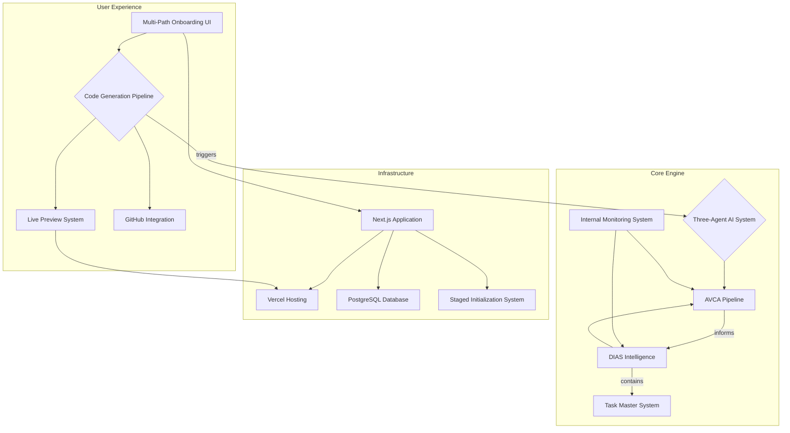

# Vibe Lab Architecture Overview

## 1. Guiding Principles

The Vibe Lab architecture is built on a set of core principles designed to create a powerful, scalable, and maintainable AI-powered development platform:

*   **AI-Centric:** The entire system is designed around a multi-agent AI core that drives the development process.
*   **Component-Based:** Following the AVCA (AI-Verified Component Architecture), the system generates and manages a library of reusable, independently verifiable components.
*   **Intelligence and Adaptation:** The DIAS (Dynamic Intelligence & Adaptation System) ensures the platform continuously learns and improves from user interaction and project evolution.
*   **Performance First:** From the UI to the API, the system is designed for responsiveness, utilizing techniques like staged initialization to guarantee a fluid user experience.
*   **Pure Tailwind CSS:** A strict, utility-first styling architecture ensures visual consistency and maintainability without the need for custom CSS.

## 2. High-Level System Diagram

## 3. Core Systems

This section provides a brief overview of the major systems within Vibe Lab. Each of these is documented in more detail in its own respective file.

### 3.1. Code Generation Pipeline

This is the high-level, user-facing workflow that orchestrates the entire project creation process. It is a sequential, four-phase pipeline where the user triggers each major step:
1.  **Roadmap Generation**: Creates the strategic, high-level project roadmap.
2.  **Task Generation**: Uses the Task Master system to create a detailed, analyzed task list.
3.  **Foundation Generation**: Generates all high-level documentation.
4.  **Scaffold Generation**: Generates the complete application code, patterns, and logs.

> **[Read the full Code Generation Pipeline Documentation](./Code_Generation_Pipeline.md)**

### 3.2. The Three-Agent AI System

The heart of Vibe Lab is a coordinated system of three distinct AI agents, each with a specialized role, model, and isolated context. This multi-agent design, built exclusively on the Anthropic Claude 3 model family, ensures high-quality output, cost-efficiency, and maintainability.

*   **Developer AI**: The primary workhorse, responsible for all code generation, planning, and implementation tasks. It uses the most powerful model to ensure high-quality, architecturally sound code.
*   **Auditor AI**: An independent agent that reviews all generated code for quality, security, and compliance. It operates in a separate context to provide unbiased feedback.
*   **Router AI**: A lightweight, high-speed agent that classifies user intent and routes requests to the appropriate system (AVCA or DIAS) or AI agent.

View AI Model Stack & Configuration

#### Core AI Stack

| Role | Model | Purpose | Context Access |
| :--- | :--- | :--- | :--- |
| **Developer** | `claude-3-opus-20240229` | Primary development, AVCA pipeline, DIAS features | Full Project |
| **Auditor** | `claude-3-opus-20240229` | Code review, quality assurance, security | Isolated Code |
| **Router** | `claude-3-haiku-20240307` | Intent classification, request routing | Minimal |

#### Rationale: Claude-Only Architecture

The decision to use a single provider simplifies the entire stack, leading to:
*   **Consistency**: A single, predictable AI behavior model.
*   **Simplicity**: One API, one integration point, and unified maintenance.
*   **Quality**: Claude models excel at complex reasoning and code generation tasks required by the AVCA pipeline.

View Cost Optimization & Performance

#### Stage-Based Model Selection

To dramatically reduce operational costs without sacrificing quality, the Developer AI dynamically switches to more cost-effective models for specific, less complex tasks within the AVCA pipeline.

*   **High-Complexity (Opus)**: Used for quality-critical stages like final verification.
*   **Medium-Complexity (Sonnet)**: Used for standard code generation and design tasks, offering an ~80% cost reduction.
*   **Low-Complexity (Haiku)**: Used for simple tasks like registry updates, offering a ~95% cost reduction.

This strategy was validated during Phase 0 E2E testing and is projected to reduce pipeline execution costs by over 80%.

#### Performance Monitoring

The system tracks key performance indicators for each AI agent to ensure reliability and speed.

| Metric | Developer AI | Auditor AI | Router AI |
| :--- | :--- | :--- | :--- |
| **p95 Latency** | < 5000ms | < 3000ms | < 400ms |
| **Success Rate** | > 98% | > 99% | > 99.9% |
| **Avg. Tokens** | ~3000 | ~2000 | ~100 |

#### Estimated Cost Per Action

*   **Single Chat Turn**: A typical conversational turn using the Router and Developer AI costs **~$0.005**.
*   **Blueprint Analysis**: The initial, one-time analysis of a project blueprint costs **~$0.10**.
*   **Full Foundation Generation**: The most expensive single operation, which involves both the Developer and Auditor AI, costs **~$8-10** per run. Our cost optimization strategies are focused on minimizing the need for these full runs.

### 3.3. AVCA (AI-Verified Component Architecture)

AVCA is the structured pipeline that transforms a user's request into production-ready code. It is a multi-stage process that includes:

1.  **Import & Analysis**: Understanding existing code or ideas.
2.  **Blueprint Creation**: Defining the project's structure and requirements.
3.  **Styling & Design**: Establishing the visual language.
4.  **Component Generation**: Creating individual components.
5.  **Quality Validation**: Auditing and testing the generated code.
6.  **Assembly**: Putting all the components together into a complete application.

> **[Read the full AVCA Documentation](./AVCA.md)** (To be created)

### 3.4. DIAS (Dynamic Intelligence & Adaptation System)

DIAS is the "brain" of Vibe Lab. It is a set of intelligence engines that run in the background, continuously monitoring the development process to provide insights and improvements. Its key functions include:

*   **Pattern Recognition**: Identifying and suggesting common patterns.
*   **Quality Analysis**: Continuously monitoring code quality.
*   **Performance Monitoring**: Tracking application performance.
*   **The Task Master System**: A sophisticated sub-system for intelligent project management, including complexity scoring, dependency mapping, resource allocation, and "Wave Orchestration".

> **[Read the full DIAS Documentation](./DIAS.md)** (To be created)

### 3.5. Live Preview System

To provide instant visual feedback, Vibe Lab utilizes a sophisticated preview system.

*   **Technology**: Leverages the **Vercel Edge Runtime** for instantaneous deployments.
*   **Functionality**: Provides a sandboxed iframe where users can interact with a live, running version of their application moments after it's generated.

> **[Read the full Preview System Documentation](./05_Preview_System.md)**

### 3.6. Staged Initialization System

To ensure the Vibe Lab API is always fast and responsive, we use a staged initialization system. This system progressively loads services in the background, ensuring that the core application is available immediately, while more complex AI services load in stages. This prevents API timeouts and creates a fluid user experience.

### 3.7. Internal Monitoring System

Vibe Lab includes a built-in monitoring system to provide real-time visibility into the internal workings of the AVCA and DIAS engines. It features a development dashboard for visualizing module activations, system decisions, and performance metrics.

> **[Read the Monitoring Guide](../../vibe-lab-product/lib/monitoring/MONITORING-GUIDE.md)**

### 3.8. Integration Layer

The Integration Layer defines the patterns and contracts that allow the AVCA and DIAS systems to communicate and work together effectively. It includes definitions for worker architectures, data flows, API contracts, and resilience patterns.

> **[Read the full Integration Layer Documentation](./Sub_Systems/Integration_Layer.md)**

## 4. Technology Stack

*   **Frontend**: Next.js 14+ with App Router, TypeScript, and Tailwind CSS.
*   **Backend**: Node.js with Next.js API Routes.
*   **Database**: PostgreSQL with Prisma ORM.
*   **Authentication**: NextAuth.js with GitHub OAuth.
*   **Hosting**: Vercel.
*   **AI**: Anthropic's Claude models.

> **[See the full Technology Stack in the Tech Architecture Blueprint](../../vibe-lab-meta/blueprints/vibe-lab-product/04-TECH-ARCHITECTURE.md)**

## 5. API & SDK Reference

For detailed information on the system's APIs, event schemas, and SDK usage, please refer to the comprehensive API reference.

> **[Read the full API Reference](./API_Reference.md)**
