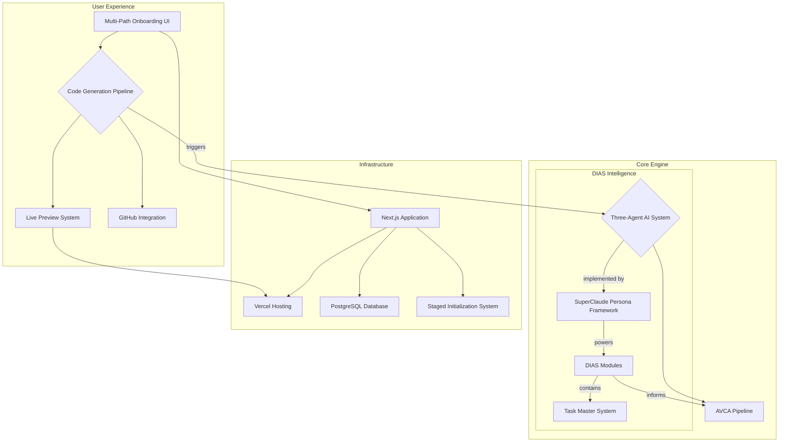

# System Architecture
**Document Type**: Technical Standard
**Status**: Authoritative
**Purpose**: This document provides a comprehensive overview of the Vibe Lab system architecture, from high-level principles and diagrams to detailed technical specifications for each major component.

---

## 1. Guiding Principles

*   **AI-Centric**: The entire system is designed around a multi-agent AI core, implemented via the **SuperClaude framework**, that drives the development process.
*   **Component-Based**: Following the AVCA (AI-Verified Component Architecture), the system generates and manages a library of reusable, independently verifiable components.
*   **Intelligence & Adaptation**: The DIAS (Dynamic Intelligence & Adaptation System) ensures the platform continuously learns and improves.
*   **Performance First**: The system is designed for responsiveness, utilizing techniques like staged initialization to guarantee a fluid user experience.
*   **Pure Tailwind CSS**: A strict, utility-first styling architecture ensures visual consistency and maintainability.

---

## 2. High-Level System Diagram

---

## 3. Core Systems Overview

This section provides a brief overview of the major systems within Vibe Lab. Each of these is documented in more detail in its own respective file.

### **3.1. Code Generation Pipeline**
The high-level, user-facing workflow that orchestrates the entire project creation process. It is a sequential, four-phase pipeline: Roadmap Generation, Task Generation, Foundation Generation, and Scaffold Generation.

### **3.2. The Three-Agent AI System**
The heart of Vibe Lab is a coordinated system of three distinct AI agents (Architect, Engineer, Auditor). This high-level model is implemented by the **SuperClaude persona framework**, a more granular system of 11 specialized personas that are activated based on the specific task. This approach ensures high-quality output, cost-efficiency, and deep expertise.
> **[Read the full AI System Documentation](./AI_System_Overview.md)**

### **3.3. AVCA (AI-Verified Component Architecture)**
AVCA is the structured pipeline that transforms a user's request into production-ready code through multiple stages, including Blueprint Creation, Component Generation, Quality Validation, and Assembly. It receives its inputs from the DIAS/SuperClaude system.
> **[Read the full AVCA Documentation](./AVCA.md)**

### **3.4. DIAS (Dynamic Intelligence & Adaptation System)**
DIAS is the "brain" of Vibe Lab. It is a set of intelligence engines, powered by the **SuperClaude framework**, that run in the background to provide insights, pattern recognition, and performance improvements.
> **[Read the full DIAS Documentation](./DIAS.md)**

---

## 4. Detailed Architecture Specifications

_(This section remains the same, as it details the technology stack, not the conceptual architecture)_

_(...content from existing document...)_
