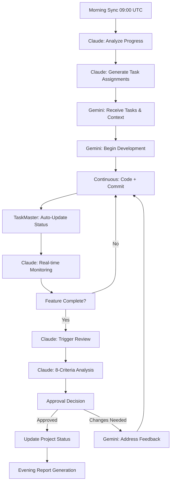

# 15 - AI Collaboration Framework

**Last Updated**: 2025-01-27

## Overview

The AI Collaboration Framework represents the next evolution in software development: systematic coordination between Gemini AI (Lead Developer) and Claude Code (Project Manager/Auditor) for autonomous, high-quality software delivery with minimal human oversight.

## Purpose

Transform traditional development processes through intelligent AI collaboration that maintains human-level quality while achieving 2-3x velocity improvements through automated task coordination, real-time code review, and systematic quality assurance.

## Core Architecture

### Role Definition Framework

#### **Gemini AI - Lead Developer**
```yaml
primary_responsibilities:
  - feature_implementation: "Write, test, and deploy production-ready code"
  - task_execution: "Complete assigned development tasks from project roadmap"
  - automated_updates: "Update TaskMaster with progress via git commits"
  - code_generation: "Create components, APIs, database schemas, integrations"
  - technical_problem_solving: "Debug issues, optimize performance, handle edge cases"

authority_boundaries:
  - technical_implementation: "Make decisions within established patterns"
  - code_structure: "Organize files, components, modules for maintainability"
  - performance_optimization: "Optimize for speed, memory, user experience"
  - library_selection: "Choose dependencies within project constraints"
  - testing_strategy: "Implement unit, integration, E2E tests"

communication_protocol:
  - daily_updates: "Commit code with descriptive messages for Claude review"
  - status_reports: "Update TaskMaster automatically via git commits"
  - escalation: "Flag complex decisions or architectural changes"
  - documentation: "Maintain inline comments and component documentation"

success_metrics:
  - tasks_per_day: "2-4 completed tasks"
  - commit_frequency: "4-8 commits per day"
  - test_coverage: ">80% for all new code"
  - code_quality_score: ">8.0/10 on automated review"
```

#### **Claude Code - Project Manager/Auditor**
```yaml
primary_responsibilities:
  - project_oversight: "Monitor progress against roadmap and timeline"
  - code_review: "Audit code quality, security, adherence to standards"
  - architecture_governance: "Ensure consistency with established patterns"
  - risk_management: "Identify potential issues and mitigation strategies"
  - quality_assurance: "Validate features meet requirements and standards"

authority_boundaries:
  - project_direction: "Adjust priorities and scope based on progress"
  - quality_standards: "Enforce coding standards, security practices"
  - architectural_decisions: "Approve or reject major architectural changes"
  - release_management: "Determine readiness for deployment and release"
  - resource_allocation: "Optimize task distribution and timeline adjustments"

communication_protocol:
  - review_cycles: "Daily code reviews with structured feedback"
  - project_reports: "Weekly status updates with metrics and risk assessment"
  - strategic_guidance: "Provide direction on complex technical decisions"
  - stakeholder_interface: "Serve as primary interface with human stakeholders"

success_metrics:
  - review_completion_time: "<2 hours for comprehensive audit"
  - escalation_accuracy: ">90% of escalations require human attention"
  - quality_gate_effectiveness: ">95% of approved code passes production"
  - project_health_monitoring: "Daily tracking with trend analysis"
```

## Technical Implementation

### Core System Components

#### **AI Collaboration System** (`gemini-claude-integration.py`)
```python
class AICollaborationSystem:
    """
    Main orchestrator for Gemini-Claude collaboration
    Handles daily sync, task assignment, progress tracking, escalation detection
    """
    
    def generate_daily_sync(self) -> Dict[str, Any]:
        """Generate comprehensive daily coordination data"""
        return {
            "project_status": self.get_project_health_metrics(),
            "gemini_assignments": self.calculate_priority_tasks(),
            "claude_priorities": self.identify_review_requirements(),
            "collaboration_metrics": self.measure_ai_effectiveness(),
            "escalations": self.detect_critical_issues(),
            "next_actions": self.plan_immediate_steps()
        }
    
    def automated_task_assignment(self) -> List[TaskAssignment]:
        """Intelligent task distribution based on complexity and dependencies"""
        development_tasks = self.filter_development_tasks()
        priority_scored = self.calculate_priority_scores(development_tasks)
        return self.assign_with_dependency_awareness(priority_scored)
```

#### **Quality Gate System** (`ai-collaboration-config.yaml`)
```yaml
quality_gates:
  pre_commit:
    enabled: true
    automated_checks:
      - lint_validation: "ESLint with project-specific rules"
      - type_checking: "TypeScript strict mode validation"
      - security_scan: "Basic vulnerability detection"
    auto_fix: true
    failure_action: "block_commit_with_guidance"
  
  post_commit:
    enabled: true
    automated_checks:
      - test_execution: "Full test suite with coverage analysis"
      - build_verification: "Successful compilation and bundling"
      - task_status_update: "Automatic TaskMaster synchronization"
    failure_action: "immediate_claude_notification"
  
  pre_merge:
    enabled: true
    manual_review_required: true
    claude_review_criteria:
      code_quality: 30%     # readability, maintainability, standards
      security: 25%        # auth, validation, access control
      performance: 20%     # bundle size, runtime, caching
      architecture: 15%    # patterns, scalability, integration
      testing: 10%        # coverage, quality, regression prevention
    
    approval_thresholds:
      auto_approve: 8.5    # Automatic approval and merge
      requires_changes: 6.0 # Request modifications from Gemini
      escalate_human: 4.0  # Critical issues requiring human review
```

### Automation Workflows

#### **Daily Development Cycle**


#### **Weekly Planning Cycle**
```yaml
monday_sprint_planning:
  time: "10:00 UTC"
  duration: "30 minutes"
  claude_responsibilities:
    - analyze_previous_week_velocity
    - adjust_priorities_based_on_progress
    - identify_dependencies_and_blockers
    - generate_weekly_task_assignments
    - update_project_timeline
  
  gemini_responsibilities:
    - review_technical_feasibility
    - provide_implementation_time_estimates
    - flag_architectural_concerns
    - confirm_understanding_of_requirements

wednesday_mid_sprint:
  claude_activities:
    - assess_progress_against_weekly_goals
    - identify_scope_adjustments_needed
    - update_stakeholder_communications
  
  gemini_activities:
    - report_technical_blockers
    - provide_revised_completion_estimates
    - request_architectural_guidance

friday_retrospective:
  analysis_areas:
    - week_achievements_vs_planned
    - lessons_learned_documentation
    - process_improvement_opportunities
    - success_pattern_identification
  
  output_artifacts:
    - performance_metrics_report
    - updated_project_roadmap
    - process_optimization_recommendations
    - knowledge_archive_updates
```

## Quality Assurance Framework

### Automated Code Review Criteria

#### **8-Criteria Assessment Matrix**
```typescript
interface CodeReviewCriteria {
  code_quality: {
    weight: 30;
    factors: ["readability", "maintainability", "standards_compliance"];
    validation_method: "static_analysis + pattern_recognition";
  };
  
  security: {
    weight: 25;
    factors: ["auth_checks", "data_validation", "access_control"];
    validation_method: "security_scanner + manual_review";
  };
  
  performance: {
    weight: 20;
    factors: ["bundle_size", "runtime_performance", "caching_strategy"];
    validation_method: "performance_profiler + benchmarks";
  };
  
  architecture: {
    weight: 15;
    factors: ["pattern_consistency", "separation_of_concerns", "scalability"];
    validation_method: "architectural_analysis + dependency_review";
  };
  
  testing: {
    weight: 10;
    factors: ["coverage_percentage", "test_quality", "regression_prevention"];
    validation_method: "coverage_analysis + test_effectiveness";
  };
}

interface ReviewDecision {
  overall_score: number;        // 0-10 composite score
  action: "approve" | "request_changes" | "escalate_human";
  feedback: StructuredFeedback;
  estimated_fix_time: string;
  architectural_impact: "none" | "low" | "medium" | "high";
}
```

### Escalation Protocols

#### **Automated Escalation Rules**
```yaml
escalation_triggers:
  quality_gate_failure:
    condition: "failed_attempts >= 3"
    escalate_to: "claude_comprehensive_review"
    max_claude_attempts: 2
    final_escalation: "human_architect"
  
  architectural_decision_required:
    condition: "new_pattern_introduction OR major_refactoring"
    escalate_to: "claude_architectural_review"
    requires_human_approval: true
    urgency_level: "high"
  
  security_concern_detected:
    condition: "security_scan_failure OR auth_bypass_risk"
    escalate_to: "immediate_human_review"
    automatic_block: true
    notification_channels: ["slack", "email"]
  
  blocked_task_duration:
    condition: "task_blocked_time > 24_hours"
    escalate_to: "claude_problem_analysis"
    if_unresolved_after: "48_hours"
    final_escalation: "human_intervention"
    priority: "urgent"
```

## Performance Metrics & Monitoring

### Collaboration Effectiveness Metrics

#### **Velocity Metrics**
```yaml
development_velocity:
  tasks_completed_per_sprint: 
    target: "15-20 tasks"
    measurement: "weekly_sprint_analysis"
  
  average_task_completion_time:
    target: "<2 days per task"
    measurement: "git_commit_analysis"
  
  rework_rate:
    target: "<15% of tasks require significant rework"
    measurement: "claude_review_feedback_analysis"
  
  review_approval_rate:
    target: ">90% first-time approvals"
    measurement: "automated_review_tracking"

quality_metrics:
  bug_density:
    target: "<1 bug per 1000 lines of code"
    measurement: "production_issue_tracking"
  
  security_vulnerabilities:
    target: "0 high/critical issues in production"
    measurement: "automated_security_scanning"
  
  performance_regression:
    target: "0 performance degradations >10%"
    measurement: "automated_performance_monitoring"
  
  test_coverage:
    target: ">80% unit tests, >70% integration tests"
    measurement: "coverage_analysis_automation"

collaboration_metrics:
  ai_response_time:
    target: "AI-to-AI messages answered within 1 hour"
    measurement: "communication_timestamp_analysis"
  
  context_retention:
    target: ">95% accuracy in understanding previous decisions"
    measurement: "decision_consistency_tracking"
  
  escalation_rate:
    target: "<10% of decisions require human intervention"
    measurement: "escalation_frequency_analysis"
  
  documentation_currency:
    target: "100% of features documented within 24 hours"
    measurement: "documentation_completeness_audit"
```

### Success Indicators Timeline

#### **Short-term Success (1-2 weeks)**
- ✅ Automated task assignment and pickup working seamlessly
- ✅ Code review cycle averaging <2 hours end-to-end completion
- ✅ Daily progress reports generated without human intervention
- ✅ Quality gates preventing broken code from reaching main branch

#### **Medium-term Success (1-2 months)**
- ✅ Feature delivery velocity increased by 40% compared to manual process
- ✅ Bug discovery rate improved through systematic review process
- ✅ Documentation automatically maintained and consistently accurate
- ✅ Predictable delivery timelines with <20% variance from estimates

#### **Long-term Success (3-6 months)**
- ✅ Self-healing development process with minimal human oversight required
- ✅ Architectural consistency maintained across all features and components
- ✅ Performance and security optimizations automatically applied and validated
- ✅ Knowledge transfer and onboarding of new team members streamlined

## Risk Management & Mitigation

### Identified Risks

#### **Technical Risks**
```yaml
over_automation_risk:
  description: "Risk of removing necessary human oversight and creativity"
  likelihood: "medium"
  impact: "high"
  mitigation_strategies:
    - maintain_human_checkpoints_for_architectural_decisions
    - preserve_human_oversight_for_user_experience_decisions
    - implement_automated_escalation_for_complex_problems
    - regular_human_review_of_ai_decision_patterns

context_loss_risk:
  description: "Potential for AIs to lose important project context over time"
  likelihood: "medium"
  impact: "medium"
  mitigation_strategies:
    - implement_robust_state_persistence_system
    - cross_session_context_validation
    - regular_context_completeness_audits
    - human_intervention_triggers_for_context_verification

quality_drift_risk:
  description: "Risk of gradually lowering standards without detection"
  likelihood: "low"
  impact: "high"
  mitigation_strategies:
    - continuous_quality_metrics_monitoring
    - trend_analysis_with_automatic_alerts
    - regular_human_audit_of_quality_standards
    - baseline_quality_benchmarks_with_deviation_detection
```

### Rollback & Recovery Procedures

#### **Emergency Protocols**
```yaml
collaboration_system_failure:
  detection: "ai_response_time > 4_hours OR escalation_rate > 50%"
  immediate_action: "switch_to_manual_development_process"
  recovery_steps:
    - preserve_current_project_state
    - notify_human_stakeholders
    - analyze_failure_root_cause
    - implement_targeted_fix
    - gradual_re_enablement_with_monitoring

quality_gate_bypass:
  detection: "production_issues_from_auto_approved_code"
  immediate_action: "enable_human_review_for_all_merges"
  recovery_steps:
    - audit_recent_auto_approved_changes
    - identify_quality_gate_gaps
    - strengthen_automated_detection
    - re_calibrate_approval_thresholds
    - gradual_automation_re_enablement

ai_agent_performance_degradation:
  detection: "success_metrics_below_baseline_for_72_hours"
  immediate_action: "increase_human_oversight_temporarily"
  recovery_steps:
    - analyze_performance_degradation_causes
    - adjust_ai_parameters_and_prompts
    - provide_additional_context_and_training
    - monitor_recovery_with_staged_autonomy_restoration
```

## Future Enhancements

### Planned Evolution (Next 6 months)

#### **Advanced AI Capabilities**
- **Predictive Analysis**: AI agents predict project risks and bottlenecks 2-3 sprints ahead
- **Self-Optimization**: System automatically adjusts processes based on success patterns
- **Cross-Project Learning**: Knowledge transfer between projects for improved efficiency
- **Advanced Code Generation**: Context-aware component generation with design system integration

#### **Integration Expansion**
- **GitHub Advanced Integration**: Automatic PR creation, issue linking, release management
- **Slack/Teams Integration**: Real-time notifications, status updates, stakeholder communications
- **Analytics Dashboard**: Comprehensive project health metrics and predictive insights
- **Customer Feedback Loop**: Integration with user feedback for priority adjustment

#### **Scalability Improvements**
- **Multi-Project Management**: Single system managing multiple concurrent projects
- **Team Scaling**: Support for multiple developer AIs with specialized roles
- **Enterprise Features**: Advanced compliance, audit trails, governance controls
- **Performance Optimization**: Sub-second response times for all AI interactions

## Conclusion

The AI Collaboration Framework represents a fundamental shift in software development methodology, moving from AI-assisted development to true AI collaboration. By establishing clear roles, automated workflows, and systematic quality assurance, this framework enables autonomous software delivery while maintaining the quality, security, and architectural consistency traditionally requiring human oversight.

The success of this system depends on three critical factors:
1. **Precise Role Definition**: Clear boundaries and responsibilities prevent conflicts and ensure coverage
2. **Automated Quality Assurance**: Comprehensive validation prevents quality degradation at scale
3. **Intelligent Escalation**: Human intervention precisely when needed, not routinely required

When fully implemented, this collaboration framework will enable development teams to focus on high-level strategy, complex problem-solving, and user experience innovation while AI agents handle the systematic implementation, review, and quality assurance processes that currently consume significant human cognitive resources.

---

*This framework establishes the foundation for the next generation of AI-powered software development, where human creativity is amplified by systematic AI collaboration rather than replaced by automation.*