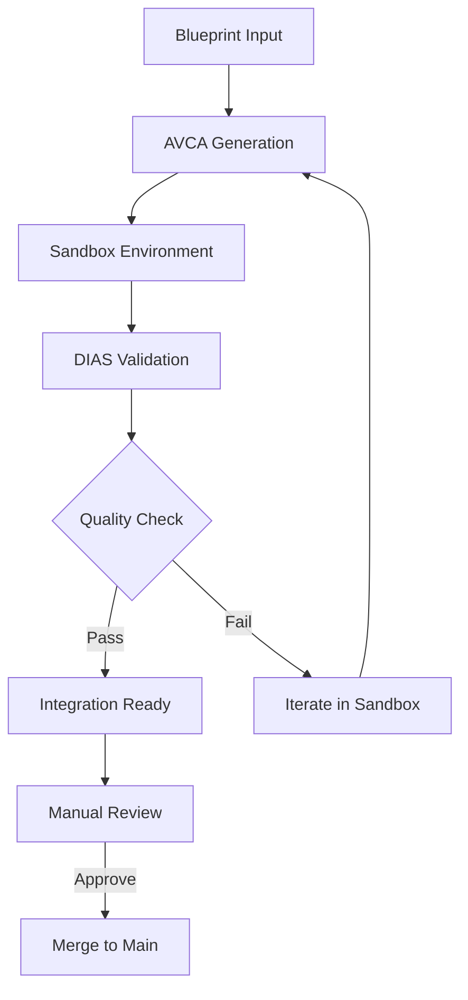

# AVCA/DIAS Testing Sandbox Design

## Overview
Create isolated environment to test AVCA/DIAS blueprint-driven development without affecting current UI/UX development.

## Sandbox Architecture

### 1. Parallel Development Structure
```
vibe-lab-product/
├── src/                    # Current UI/UX (protected)
├── sandbox/               # AVCA/DIAS testing (new)
│   ├── generated/         # AVCA-generated components
│   ├── experiments/       # DIAS-analyzed features
│   ├── validation/        # Blueprint compliance tests
│   └── integration/       # Successful features ready for merge
└── blueprints/           # Shared blueprint specifications
```

### 2. Safe Testing Workflow


## Testing Scenarios

### Phase 1: Component Generation Testing
**Target**: Missing components from blueprints
- Generate styling page components
- Create component selection interface  
- Build DIAS intelligence dashboard
- Test template variation system

### Phase 2: Page Assembly Testing
**Target**: Missing pages from current implementation
- `/project/[id]/design/styling` page
- `/dashboard/intelligence` DIAS interface
- Component library browsing interface
- Advanced deployment workflow pages

### Phase 3: Full Feature Testing
**Target**: Complete new features
- Stage 0 import enhancements
- Advanced component customization
- Real-time DIAS insights
- Blueprint editor improvements

## Sandbox Implementation

### 1. Isolated Generation Environment
```typescript
interface SandboxConfig {
  workspace: "vibe-lab-product/sandbox/";
  blueprints: "../../blueprints/vibe-lab-product/";
  avca_config: {
    output_directory: "./generated/";
    template_base: "strike"; // From blueprints
    compliance_check: true;
  };
  dias_config: {
    analysis_output: "./validation/";
    blueprint_validation: true;
    quality_scoring: true;
  };
}
```

### 2. Safety Mechanisms
```typescript
interface SafetyMechanisms {
  isolation: {
    separate_workspace: true;
    no_main_code_modification: true;
    independent_testing: true;
  };
  
  validation: {
    blueprint_compliance: "Required before integration";
    manual_review: "Required for all generated code";
    incremental_testing: "Test individual components first";
  };
  
  rollback: {
    git_branches: "Feature branches for each experiment";
    backup_strategy: "Current main protected";
    easy_cleanup: "Sandbox can be deleted without impact";
  };
}
```

## Test Cases for AVCA/DIAS

### 1. Blueprint Interpretation Test
**Input**: UI/UX Blueprint (Strike + Cursor design)
**Expected Output**: Components matching exact specifications
**Validation**: DIAS confirms Strike aesthetic compliance

### 2. Component Generation Test  
**Input**: Component specifications from blueprints
**Expected Output**: Pure Tailwind components with template variations
**Validation**: 100% Tailwind compliance, no custom CSS

### 3. Architecture Compliance Test
**Input**: Technical Architecture Blueprint
**Expected Output**: Code following project patterns
**Validation**: API routes, TypeScript types, security patterns

### 4. Integration Pattern Test
**Input**: Patterns Master Blueprint
**Expected Output**: Reusable implementations
**Validation**: Consistent with established patterns

## Success Metrics

### AVCA Performance
- **Blueprint Accuracy**: Generated code matches blueprint specs (>90%)
- **Tailwind Compliance**: 100% pure Tailwind output
- **Component Quality**: Functional components with proper TypeScript
- **Template Variations**: Correct Strike/Linear/Apple theme implementations

### DIAS Intelligence  
- **Pattern Recognition**: Identifies blueprint patterns in existing code
- **Quality Scoring**: Accurate scoring against blueprint standards
- **Compliance Checking**: Catches architecture violations
- **Recommendations**: Useful suggestions for improvement

### Integration Success
- **Generated Code Quality**: Ready for production use
- **Manual Review Time**: <30 minutes per component
- **Integration Effort**: Minimal modification needed
- **System Validation**: Proves blueprint-driven development works

## Implementation Plan

### Week 1: Sandbox Setup
- Create isolated sandbox environment
- Configure AVCA/DIAS for blueprint input
- Set up validation and testing framework
- Create safety mechanisms

### Week 2: Component Testing
- Generate 5-10 missing components
- Test template variation system  
- Validate Strike aesthetic compliance
- Refine AVCA/DIAS based on results

### Week 3: Page Assembly
- Generate complete missing pages
- Test full AVCA pipeline (Stages 1-8)
- Validate DIAS intelligence insights
- Integration testing with current system

### Week 4: Production Integration
- Merge successful experiments
- Update blueprints based on learnings
- Document AVCA/DIAS improvements
- Plan next development phase

## Risk Mitigation

### Development Velocity Protection
- Current UI/UX development continues unaffected
- Sandbox experiments are additive, not disruptive  
- Failed experiments don't impact main codebase
- Learning improves future development speed

### Quality Assurance
- All generated code reviewed before integration
- Blueprint compliance required for merge
- Incremental testing reduces risk
- Easy rollback if issues discovered

### Resource Management
- Time-boxed experiments (max 1 week each)
- Clear success/failure criteria
- Regular progress reviews
- Focus on high-value test cases

---

*This sandbox approach allows us to safely test and refine our AVCA/DIAS systems while protecting current development progress and proving the value of blueprint-driven development.*