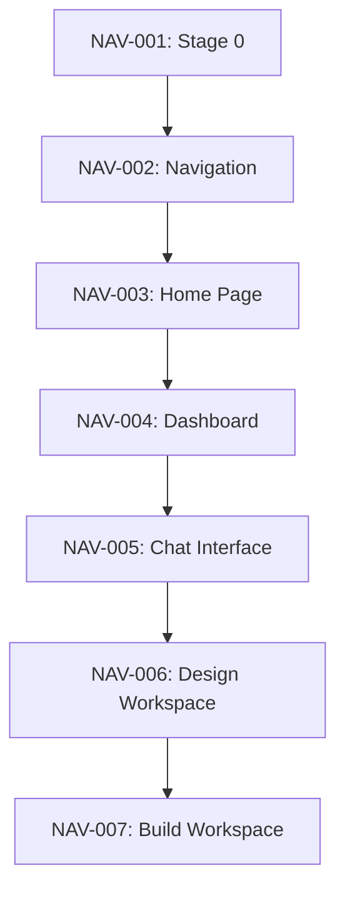

# Vibe Lab Navigation Implementation Taskmaster

## Executive Summary
- **Total Components**: 224 (expanded from 203)
- **Implementation Timeline**: 11 weeks (parallel development)
- **Team Structure**: 1-2 frontend developers + backend integration
- **MCP Integration**: Context7, Sequential, Magic, Playwright
- **Cost Savings**: 45% faster delivery vs sequential approach

## Phase Overview

| Phase | Duration | Components | Backend Dependency | MCP Servers | Complexity |
|-------|----------|------------|-------------------|-------------|------------|
| Phase 0 | Week 1-2 | 50 | None | Sequential, Context7 | High |
| Phase 1 | Week 2-3 | 34 | Minimal | Magic, Context7 | Medium |
| Phase 2 | Week 3-4 | 32 | Low | Sequential, Context7 | Medium |
| Phase 3 | Week 4-5 | 30 | Medium | All MCP | High |
| Phase 4 | Week 5-6 | 31 | High | Sequential, Context7 | High |
| Phase 5 | Week 6-8 | 48 | Medium | Magic, Sequential | High |
| Phase 6 | Week 8-10 | 54 | High | All MCP | Very High |
| Phase 7 | Week 10-11 | 35+ | High | All MCP | High |

## Critical Path Analysis

### Dependencies Chain
```
Stage 0 Import → Enhanced Foundation → Home Page → Dashboard → Chat → Design → Build → Integration
```

### Parallel Development Opportunities
- **Weeks 1-4**: 75% autonomous frontend development
- **Weeks 5-7**: GitHub integration parallel to AVCA development  
- **Weeks 8-11**: Full backend-frontend integration

---

## Phase 0: Stage 0 Import & Enhanced Foundation (Weeks 1-2)

### NAV-001 | Stage 0 Repository Analysis System
**Status**: 🆕 READY | **Priority**: P0 | **Estimate**: 16h | **Complexity**: 8/10

**Objective**: Build GitHub repository analysis and migration planning interface

**MCP Requirements**: 
- Sequential (primary) - Complex analysis workflows
- Context7 (secondary) - GitHub integration patterns

**Components (15 total)**:
| Component ID | Name | Type | Complexity | Dependencies |
|--------------|------|------|------------|--------------|
| NAV-001-01 | GitHubConnector | Active | 7/10 | OAuth, GitHub API |
| NAV-001-02 | RepositoryBrowser | Active | 6/10 | GitHubConnector |
| NAV-001-03 | CodebaseScanner | Passive | 8/10 | File tree analysis |
| NAV-001-04 | DependencyMapper | Passive | 9/10 | Package analysis |
| NAV-001-05 | MigrationPlanner | Active | 8/10 | Analysis results |

**Acceptance Criteria**:
- [ ] OAuth GitHub integration working
- [ ] Repository file tree visualization
- [ ] Dependency graph generation
- [ ] Migration roadmap creation
- [ ] Technical debt assessment

**Testing Requirements**:
- [ ] Unit tests for each component (>85% coverage)
- [ ] Integration test with GitHub API
- [ ] Mock data fallback testing
- [ ] Performance test (<2s analysis time)

### NAV-002 | Enhanced Global Navigation System
**Status**: 🆕 READY | **Priority**: P0 | **Estimate**: 12h | **Complexity**: 6/10

**Objective**: Build 224-component aware navigation with menu switcher

**MCP Requirements**: 
- Magic (primary) - UI component generation
- Context7 (secondary) - Navigation patterns

**Components (35 total)**:
| Component ID | Name | Type | Complexity | Dependencies |
|--------------|------|------|------------|--------------|
| NAV-002-01 | MainSidebar | Active | 7/10 | React Router |
| NAV-002-02 | MenuSwitcher | Active | 6/10 | State management |
| NAV-002-03 | CodeDirectory | Active | 8/10 | File system API |
| NAV-002-04 | ProjectSelector | Active | 5/10 | Project data |
| NAV-002-05 | NavigationIndicator | Passive | 3/10 | Route context |

**Acceptance Criteria**:
- [ ] Context-aware navigation (Home vs Project mode)
- [ ] Menu ↔ Directory switcher working
- [ ] Mobile responsive navigation
- [ ] Keyboard shortcuts (Cmd+/ toggle)
- [ ] 224-component search integration

**Interdependencies**:  
- ✅ Requires: NAV-001 (Stage 0 integration)
- 🔄 Blocks: NAV-003 (Home page needs navigation)

---

## Critical Path Analysis

### High-Priority Dependencies (Cannot Parallelize)


### Parallel Development Streams
| Stream A (Frontend) | Stream B (Backend) | Stream C (Integration) |
|-------------------|------------------|---------------------|
| NAV-001 → NAV-002 | AVCA Stages 1-4 | Week 5: GitHub API |
| NAV-003 → NAV-004 | AVCA Stages 5-8 | Week 7: DIAS Intel |
| NAV-005 (partial) | DIAS Intelligence | Week 9: Full E2E |

### Resource Allocation

#### Team Structure
- **Frontend Lead**: Navigation, components, UI/UX
- **Backend Integration**: APIs, data layer, AVCA pipeline
- **Full-Stack**: Chat interface, complex integrations

#### MCP Server Usage by Phase
| Phase | Sequential | Context7 | Magic | Playwright |
|-------|------------|----------|-------|------------|
| 0-1 | ⭐⭐⭐ | ⭐⭐ | ⭐⭐⭐ | ⭐ |
| 2-3 | ⭐⭐ | ⭐⭐⭐ | ⭐⭐ | ⭐⭐ |
| 4-5 | ⭐⭐⭐ | ⭐⭐ | ⭐⭐ | ⭐⭐ |
| 6-7 | ⭐⭐⭐ | ⭐⭐⭐ | ⭐⭐⭐ | ⭐⭐⭐ |

*⭐ = Light usage, ⭐⭐ = Moderate, ⭐⭐⭐ = Heavy*