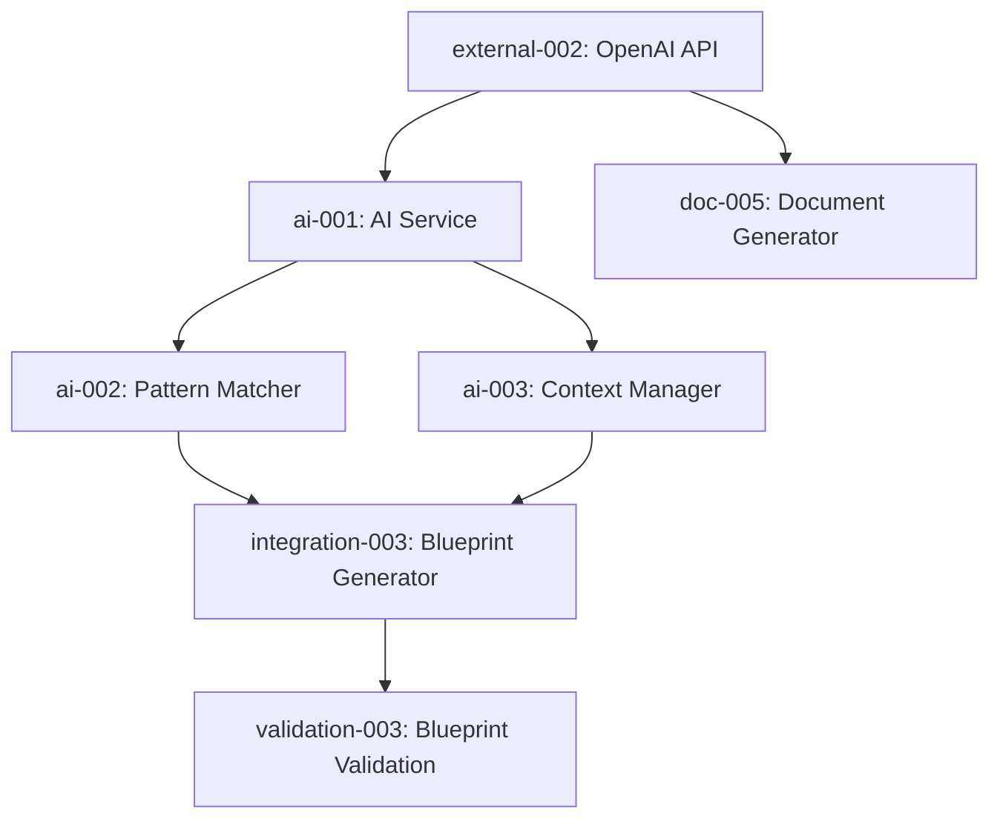

# Vibe Lab Complete Onboarding Implementation Roadmap

## Overview
This roadmap consolidates all onboarding components into a phased implementation plan, integrating specifications from our comprehensive documentation suite.

## Related Documentation
- `avca-dias-precursor-roadmap.md` - Backend system preparation and integration
- `quick-action-system-technical-specification.md` - Quick Action system implementation details
- `real-time-document-crafting-ui-technical-specification.md` - Document generation system
- `ai-onboarding-system-technical-specification.md` - AI intelligence integration
- `extended-onboarding-steps-technical-specification.md` - Detailed step implementation
- `multi-path-onboarding-specification.md` - Entry point handling
- `onboarding-implementation-guide-v2.md` - Implementation guidelines
- `onboarding-system-enhancements.md` - System improvements
- `avca-dias-core-updates.md` - Core system updates

## Phase 1: Foundation (Week 1)

### Days 1-2: Core Infrastructure
```yaml
Components:
  - OnboardingLayout (visual builder left, chat right)
  - QuickActionButton system
  - OnboardingChat base component
  - Message handling & state management
  - Route setup (/onboarding)

Key Files:
  - components/onboarding/OnboardingLayout.tsx
  - components/ui/QuickActionButton.tsx
  - components/onboarding/OnboardingChat.tsx
  - lib/stores/onboarding-store.ts
```

### Days 3-4: Document Generation
See `real-time-document-crafting-ui-technical-specification.md` for detailed implementation.

```yaml
Components:
  - LiveDocumentPreview
  - TypewriterEffect
  - SectionActions (approve/regenerate/edit)
  - DocumentMasterControls
  - Real-time document building

Key Files:
  - components/onboarding/LiveDocumentPreview.tsx
  - components/onboarding/DocumentSection.tsx
  - lib/services/document-generator.ts
```

### Day 5: AI Intelligence
See `ai-onboarding-system-technical-specification.md` for complete AI integration details.

```yaml
Services:
  - OnboardingAIService
  - Pattern matching for project types
  - Information extraction
  - Context management
  - Quick action generation

Key Files:
  - lib/services/onboarding-ai.service.ts
  - lib/services/pattern-matcher.ts
  - lib/services/context-manager.ts
```

## Phase 2: Extended Steps (Week 2)
See `extended-onboarding-steps-technical-specification.md` for comprehensive implementation details of all extended steps.

### Days 6-7: Page Structure
```yaml
Components:
  - PagesStep with drag-drop grid
  - SubPagesStep with tree view
  - NavigationStep with style selector
  - Visual builders for each

Key Files:
  - components/onboarding/steps/PagesStep.tsx
  - components/onboarding/steps/SubPagesStep.tsx
  - components/onboarding/steps/NavigationStep.tsx
  - components/onboarding/builders/PageBuilder.tsx
```

### Days 8-9: Components & Styling
```yaml
Components:
  - ComponentsStep with wireframe builder
  - Component library sidebar
  - StylingStep with template gallery
  - Website style analyzer

Key Files:
  - components/onboarding/steps/ComponentsStep.tsx
  - components/onboarding/steps/StylingStep.tsx
  - lib/services/style-analyzer.ts
  - app/api/analyze-style/route.ts
```

### Day 10: Integration
```yaml
Tasks:
  - Connect all steps in ExtendedOnboarding
  - Database schema updates
  - Blueprint generation
  - AVCA pipeline connection

Key Files:
  - components/onboarding/ExtendedOnboarding.tsx
  - lib/services/blueprint-generator.ts
  - server/api/routers/onboarding.ts
```

## Phase 3: Polish & Launch (Week 3)

### Days 11-12: Quick Actions Everywhere
See `quick-action-system-technical-specification.md` for detailed Quick Action system implementation.

```yaml
Extend Quick Actions to:
  - Design workspace
  - Build workspace
  - Dashboard
  - Error recovery flows

Key Files:
  - lib/services/quick-action-generator.ts
  - Updated workspace components
```

### Days 13-14: Testing & Refinement
```yaml
Testing:
  - End-to-end onboarding flows
  - Quick action interactions
  - Document generation accuracy
  - Style analysis functionality
  - Mobile responsiveness

Polish:
  - Loading states
  - Error handling
  - Animations
  - Analytics integration
```

## Database Schema

```prisma
// Add to existing schema
model OnboardingSession {
  id            String   @id @default(cuid())
  userId        String
  projectId     String?  @unique
  stage         String
  context       Json
  completed     Boolean  @default(false)
  
  // Extended data
  pages         Json     // Page structure
  navigation    Json     // Navigation config
  components    Json     // Component mapping
  styling       Json     // Style choices
  
  createdAt     DateTime @default(now())
  updatedAt     DateTime @updatedAt
}

model ProjectBlueprint {
  id            String   @id @default(cuid())
  projectId     String   @unique
  
  // Core documents
  overview      Json     // Project Overview
  specs         Json     // Build Specifications
  
  // Extended structure
  pages         Json     // Complete page hierarchy
  navigation    Json     // Navigation structure
  components    Json     // Component assignments
  styling       Json     // Visual design system
  
  // Metadata
  version       Int      @default(1)
  approved      Boolean  @default(false)
  createdAt     DateTime @default(now())
  updatedAt     DateTime @updatedAt
}
```

## Integration Points

### 1. Route Structure
```typescript
// app/(app)/onboarding/
├── page.tsx                    // Main orchestrator
├── layout.tsx                  // Onboarding-specific layout
└── steps/
    ├── overview/page.tsx       // Steps 1-3
    ├── structure/page.tsx      // Steps 4-6
    └── design/page.tsx         // Steps 7-8
```

### 2. State Management
```typescript
// Zustand store for onboarding state
interface OnboardingStore {
  // Current progress
  currentStep: OnboardingStep;
  completedSteps: OnboardingStep[];
  
  // Collected data
  projectOverview: ProjectOverview;
  buildSpecs: BuildSpecifications;
  pages: Page[];
  navigation: NavigationConfig;
  components: ComponentMapping;
  styling: StyleConfig;
  
  // Actions
  updateStep: (step: OnboardingStep) => void;
  updateData: (step: OnboardingStep, data: any) => void;
  generateBlueprint: () => Promise<Blueprint>;
}
```

### 3. Component Hierarchy
```
ExtendedOnboarding (orchestrator)
├── OnboardingHeader (progress)
├── OnboardingLayout (split view)
│   ├── VisualBuilder (left 60%)
│   │   ├── PagesBuilder
│   │   ├── NavigationDesigner
│   │   ├── WireframeCanvas
│   │   └── StyleSelector
│   └── OnboardingChat (right 40%)
│       ├── MessageList
│       ├── QuickActionBar
│       └── ChatInput
└── OnboardingFooter (navigation)
```

## Key Implementation Principles

1. **Visual Builders First** - Every step has a visual component
2. **Quick Actions Always** - Minimize typing, maximize clicking
3. **Real-Time Preview** - Show changes immediately
4. **Progressive Disclosure** - One concept per step
5. **Flexibility** - Allow skipping/editing any step
6. **Mobile Responsive** - Works on tablets (not phones)

## Success Criteria

- [ ] Complete flow in under 20 minutes
- [ ] Non-technical users succeed without help
- [ ] Generate valid AVCA blueprint
- [ ] All Quick Actions functional
- [ ] Visual builders intuitive
- [ ] Style analyzer accurate
- [ ] Mobile responsive (tablet+)

## Multi-Path Support
See `multi-path-onboarding-specification.md` for detailed implementation of different entry points:
- Fresh start flow
- GitHub import flow
- Code migration flow
- Documentation import flow

## Implementation Guidelines
For detailed implementation guidance, refer to:
- `onboarding-implementation-guide-v2.md` - Main implementation guide
- `onboarding-system-enhancements.md` - System improvements and optimizations
- `avca-dias-core-updates.md` - Core system integration details

## Dependencies

### External Services
- Puppeteer (for style analysis)
- OpenAI API (for AI intelligence)
- GitHub API (for repo creation)

### Internal Systems
- AVCA Pipeline (receives blueprint)
- Authentication (user session)
- Database (storing progress)
- Quick Action System (UI interactions)

---

## Comprehensive Task Management System

### Task Overview Dashboard

**Total Tasks**: 52 tasks across 4 phases
**High Priority**: 31 tasks | **Medium Priority**: 17 tasks | **Low Priority**: 4 tasks

| Phase | Tasks | Critical Path | Estimated Duration |
|-------|-------|---------------|-------------------|
| Phase 1: Foundation | 14 tasks | infra-001 → doc-001 → ai-001 | 5 days |
| Phase 2: Extended Steps | 13 tasks | pages-001 → comp-001 → integration-001 | 5 days |
| Phase 3: Polish & Launch | 13 tasks | quick-001 → test-001 → validation-001 | 4 days |
| Multi-Path & Dependencies | 12 tasks | external-002 → internal-001 → multi-001 | 2-3 days (parallel) |

### Task Status Matrix

#### Phase 1: Foundation (Days 1-5)

| Task ID | Component | Priority | Complexity | Dependencies | Estimated Hours |
|---------|-----------|----------|------------|--------------|----------------|
| infra-001 | OnboardingLayout | High | Medium | None | 8h |
| infra-002 | QuickActionButton | High | Medium | infra-001 | 6h |
| infra-003 | OnboardingChat | High | Medium | infra-001 | 8h |
| infra-004 | Route Structure | High | Low | None | 4h |
| infra-005 | Zustand Store | High | Medium | infra-003, infra-004 | 6h |
| doc-001 | LiveDocumentPreview | High | High | infra-001, infra-005 | 10h |
| doc-002 | TypewriterEffect | Medium | Low | doc-001 | 4h |
| doc-003 | SectionActions | High | Medium | doc-001 | 6h |
| doc-004 | DocumentMasterControls | Medium | Medium | doc-001, doc-003 | 6h |
| doc-005 | Document Generator Service | High | High | external-002 | 8h |
| ai-001 | OnboardingAIService | High | High | external-002 | 10h |
| ai-002 | Pattern Matcher | High | High | ai-001 | 8h |
| ai-003 | Context Manager | High | High | ai-001 | 8h |
| ai-004 | Quick Action Generation | Medium | Medium | ai-002, ai-003, infra-002 | 6h |

**Phase 1 Critical Dependencies**:
- `external-002` (OpenAI API) blocks `doc-005`, `ai-001`
- `infra-001` (OnboardingLayout) is prerequisite for all UI components
- `infra-005` (Zustand Store) needed for state management across components

#### Phase 2: Extended Steps (Days 6-10)

| Task ID | Component | Priority | Complexity | Dependencies | Estimated Hours |
|---------|-----------|----------|------------|--------------|----------------|
| pages-001 | PagesStep | High | High | infra-005, ai-003 | 12h |
| pages-002 | SubPagesStep | High | High | pages-001 | 10h |
| pages-003 | NavigationStep | High | Medium | pages-002 | 8h |
| pages-004 | PageBuilder | High | High | pages-001 | 12h |
| comp-001 | ComponentsStep | High | High | pages-004 | 12h |
| comp-002 | Component Library Sidebar | Medium | Medium | comp-001 | 8h |
| comp-003 | StylingStep | High | High | comp-001 | 10h |
| comp-004 | Style Analyzer Service | High | High | external-001 | 10h |
| comp-005 | Analyze Style API | Medium | Medium | comp-004 | 6h |
| integration-001 | ExtendedOnboarding | High | High | All previous steps | 8h |
| integration-002 | Database Schema | High | Medium | internal-003 | 4h |
| integration-003 | Blueprint Generator | High | High | internal-001, ai-003 | 10h |
| integration-004 | Onboarding API Routes | High | Medium | integration-002 | 6h |

**Phase 2 Critical Dependencies**:
- `external-001` (Puppeteer) blocks `comp-004`
- `internal-001` (AVCA Pipeline) blocks `integration-003`
- `internal-003` (Database) blocks `integration-002`
- Sequential flow: pages → components → integration

#### Phase 3: Polish & Launch (Days 11-14)

| Task ID | Component | Priority | Complexity | Dependencies | Estimated Hours |
|---------|-----------|----------|------------|--------------|----------------|
| quick-001 | Design Workspace Quick Actions | Medium | Medium | integration-001 | 6h |
| quick-002 | Build Workspace Quick Actions | Medium | Medium | integration-001 | 6h |
| quick-003 | Dashboard Quick Actions | Medium | Medium | integration-001 | 4h |
| quick-004 | Error Recovery Flows | Low | Low | quick-001, quick-002 | 4h |
| quick-005 | Quick Action Generator Update | Medium | Medium | ai-004 | 4h |
| test-001 | E2E Flow Tests | High | High | integration-001 | 12h |
| test-002 | Quick Action Testing | Medium | Medium | quick-001, quick-002 | 6h |
| test-003 | Document Generation Tests | High | Medium | doc-005 | 6h |
| test-004 | Style Analysis Testing | Medium | Medium | comp-005 | 4h |
| test-005 | Mobile Responsiveness | Medium | Medium | All UI components | 8h |
| polish-001 | Loading States | Medium | Low | All components | 6h |
| polish-002 | Error Handling | High | Medium | All components | 8h |
| polish-003 | Animations | Low | Low | All UI components | 4h |
| polish-004 | Analytics Integration | Low | Medium | integration-001 | 4h |

**Phase 3 Critical Dependencies**:
- `integration-001` blocks most Phase 3 tasks
- Testing tasks depend on completion of respective features
- Polish tasks can run in parallel after core features complete

#### Multi-Path & Dependencies (Parallel)

| Task ID | Component | Priority | Complexity | Dependencies | Estimated Hours |
|---------|-----------|----------|------------|--------------|----------------|
| multi-001 | Fresh Start Flow | Medium | Medium | integration-001 | 6h |
| multi-002 | GitHub Import Flow | Medium | High | external-003 | 8h |
| multi-003 | Code Migration Flow | Low | High | ai-002 | 10h |
| multi-004 | Documentation Import | Low | Medium | ai-003 | 6h |
| external-001 | Puppeteer Setup | Medium | Low | None | 2h |
| external-002 | OpenAI API Config | High | Medium | None | 4h |
| external-003 | GitHub API Setup | Medium | Medium | None | 3h |
| internal-001 | AVCA Pipeline Connection | High | High | None | 6h |
| internal-002 | Authentication Integration | High | Medium | None | 4h |
| internal-003 | Database Integration | High | Medium | None | 4h |

### Validation Checklist

| Task ID | Success Criteria | Priority | Test Method | Acceptance Criteria |
|---------|------------------|----------|-------------|---------------------|
| validation-001 | Flow Completion Time | High | User Testing | <20 minutes average |
| validation-002 | Non-Technical User Success | High | User Testing | >80% success rate |
| validation-003 | AVCA Blueprint Generation | High | Integration Testing | Valid blueprint output |
| validation-004 | Quick Actions Functionality | Medium | E2E Testing | All actions responsive |
| validation-005 | Visual Builder Intuitiveness | Medium | Usability Testing | >4/5 user rating |
| validation-006 | Style Analyzer Accuracy | Medium | Automated Testing | >85% accuracy rate |
| validation-007 | Mobile Responsiveness | Medium | Device Testing | Tablet+ compatibility |

### Risk Assessment & Mitigation

#### High-Risk Tasks (Complexity: High + External Dependencies)

| Risk Level | Task IDs | Risk Factors | Mitigation Strategy |
|------------|----------|--------------|-------------------|
| **Critical** | ai-001, ai-002, doc-005 | OpenAI API dependency, complex logic | Implement fallback modes, thorough testing |
| **High** | pages-001, comp-001, integration-003 | Complex UI builders, AVCA integration | Prototype early, incremental development |
| **Medium** | comp-004, multi-002 | External service dependencies | Mock services for development |

#### Dependency Chain Risk Analysis



**Critical Path**: external-002 → ai-001 → ai-002/ai-003 → integration-003 → validation-003

### Performance Metrics & KPIs

#### Development Velocity Targets

| Metric | Target | Current Status | Risk Level |
|--------|--------|---------------|------------|
| Phase 1 Completion | 5 days | Pending | Low |
| Phase 2 Completion | 5 days | Pending | Medium |
| Phase 3 Completion | 4 days | Pending | Low |
| Total Project Duration | 14 days | Pending | Medium |
| Code Quality Score | >90% | TBD | Low |
| Test Coverage | >85% | TBD | Medium |

#### Success Criteria Tracking

| KPI | Target | Measurement Method | Current Status |
|-----|--------|-------------------|----------------|
| User Completion Rate | >80% | Analytics tracking | Not implemented |
| Average Completion Time | <20 minutes | User session data | Not measured |
| Blueprint Accuracy | >95% | AVCA validation | Not implemented |
| User Satisfaction | >4.5/5 | Post-completion survey | Not implemented |
| Technical Performance | <2s load time | Performance monitoring | Not measured |

---

*This comprehensive task management system provides detailed tracking, dependency analysis, and risk assessment for the complete onboarding implementation roadmap.*